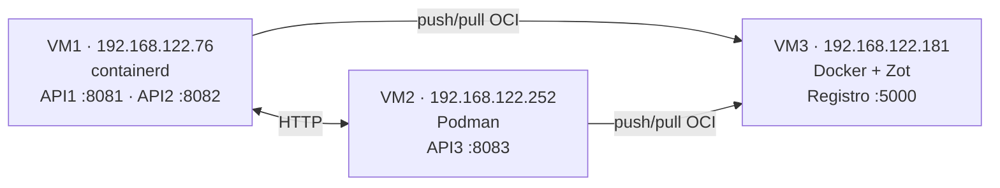

# Proyecto 1 — Laboratorio de Sistemas Operativos 1

Implementación de tres APIs en Go distribuidas entre dos máquinas virtuales, utilizando distintos motores de contenedores y un registro OCI privado Zot.

**Estudiante:** Victor Hugo Velásquez Hernández  
**Carné:** 202100054  

## Arquitectura



| Máquina | Dirección IP | Tecnología | Responsabilidad |
|---|---|---|---|
| VM1 | `192.168.122.76` | containerd, nerdctl, BuildKit y CNI | Construcción y ejecución de API1 y API2 |
| VM2 | `192.168.122.252` | Podman | Construcción y ejecución de API3 |
| VM3 | `192.168.122.181` | Docker | Ejecución del registro privado Zot |

> Las direcciones IP corresponden al entorno del laboratorio y pueden cambiar si las máquinas virtuales utilizan DHCP.

## Flujo de imágenes

```text
API1 y API2 → nerdctl/BuildKit → Zot en VM3 → containerd en VM1
API3        → Podman           → Zot en VM3 → Podman en VM2
```

Las imágenes almacenadas en Zot son:

- `192.168.122.181:5000/proyecto1-api1:v1`
- `192.168.122.181:5000/proyecto1-api2:v1`
- `192.168.122.181:5000/proyecto1-api3:v1`

## Estructura del repositorio

```text
.
├── api1/
│   ├── .dockerignore
│   ├── Dockerfile
│   └── main.go
├── api2/
│   ├── .dockerignore
│   ├── Dockerfile
│   └── main.go
├── api3/
│   ├── .dockerignore
│   ├── Dockerfile
│   └── main.go
├── .gitignore
└── README.md
```

## Endpoints

### API1 — VM1, puerto 8081

| Método | Ruta | Descripción |
|---|---|---|
| GET | `/health` | Estado de API1 |
| GET | `/api1/{carnet}/call-api2` | Comunicación de API1 hacia API2 |
| GET | `/api1/{carnet}/call-api3` | Comunicación de API1 hacia API3 |

### API2 — VM1, puerto 8082

| Método | Ruta | Descripción |
|---|---|---|
| GET | `/health` | Estado de API2 |
| GET | `/api2/{carnet}/call-api3` | Comunicación de API2 hacia API3 |

### API3 — VM2, puerto 8083

| Método | Ruta | Descripción |
|---|---|---|
| GET | `/health` | Estado de API3 |
| GET | `/api3/{carnet}/call-api1` | Comunicación de API3 hacia API1 |
| GET | `/api3/{carnet}/call-api2` | Comunicación de API3 hacia API2 |

## Variables de entorno

| API | Variable | Valor en el despliegue final |
|---|---|---|
| API1 | `API2_URL` | `http://192.168.122.76:8082` |
| API1 | `API3_URL` | `http://192.168.122.252:8083` |
| API2 | `API1_URL` | `http://192.168.122.76:8081` |
| API2 | `API3_URL` | `http://192.168.122.252:8083` |
| API3 | `API1_URL` | `http://192.168.122.76:8081` |
| API3 | `API2_URL` | `http://192.168.122.76:8082` |

## Versiones utilizadas

- containerd `2.2.1`
- nerdctl `2.3.1`
- BuildKit `0.32.2`
- CNI plugins `1.9.1`
- Podman `3.4.4`
- Docker `29.1.3`
- Zot: `ghcr.io/project-zot/zot-linux-amd64:latest`

## Construcción de imágenes

### API1 y API2 con containerd en VM1

Construcción de API1:

```bash
cd /home/vjr/proyecto1/api1

sudo nerdctl build \
  --progress=plain \
  -t proyecto1-api1:v1 .
```

Construcción de API2:

```bash
cd /home/vjr/proyecto1/api2

sudo nerdctl build \
  --progress=plain \
  -t proyecto1-api2:v1 .
```

Verificación:

```bash
sudo nerdctl images
```

### API3 con Podman en VM2

```bash
cd /home/vjr/proyecto1/api3

podman build \
  --format docker \
  -t proyecto1-api3:v1 .
```

Verificación:

```bash
podman images
```

## Registro Zot en VM3

### Creación del volumen persistente

```bash
sudo docker volume create zot-data
```

### Ejecución de Zot

```bash
sudo docker run -d \
  --name zot \
  --restart=unless-stopped \
  -p 5000:5000 \
  -v zot-data:/var/lib/registry:z \
  ghcr.io/project-zot/zot-linux-amd64:latest
```

### Verificación del registro

```bash
sudo docker ps
```

```bash
curl -s -o /dev/null \
  -w 'HTTP %{http_code}\n' \
  http://localhost:5000/v2/
```

El resultado esperado es:

```text
HTTP 200
```

## Publicación de imágenes en Zot

### API1 y API2 desde VM1

Etiquetar API1:

```bash
sudo nerdctl tag \
  proyecto1-api1:v1 \
  192.168.122.181:5000/proyecto1-api1:v1
```

Etiquetar API2:

```bash
sudo nerdctl tag \
  proyecto1-api2:v1 \
  192.168.122.181:5000/proyecto1-api2:v1
```

Publicar API1:

```bash
sudo nerdctl --insecure-registry push \
  192.168.122.181:5000/proyecto1-api1:v1
```

Publicar API2:

```bash
sudo nerdctl --insecure-registry push \
  192.168.122.181:5000/proyecto1-api2:v1
```

### API3 desde VM2

Etiquetar API3:

```bash
podman tag \
  localhost/proyecto1-api3:v1 \
  192.168.122.181:5000/proyecto1-api3:v1
```

Publicar API3:

```bash
podman push \
  --tls-verify=false \
  192.168.122.181:5000/proyecto1-api3:v1
```

## Verificación del contenido de Zot

Consultar el catálogo:

```bash
curl http://192.168.122.181:5000/v2/_catalog
```

Respuesta esperada:

```json
{
  "repositories": [
    "proyecto1-api1",
    "proyecto1-api2",
    "proyecto1-api3"
  ]
}
```

Consultar las etiquetas:

```bash
curl http://192.168.122.181:5000/v2/proyecto1-api1/tags/list
curl http://192.168.122.181:5000/v2/proyecto1-api2/tags/list
curl http://192.168.122.181:5000/v2/proyecto1-api3/tags/list
```

## Descarga de imágenes desde Zot

### VM1 con containerd

```bash
sudo nerdctl --insecure-registry pull \
  192.168.122.181:5000/proyecto1-api1:v1
```

```bash
sudo nerdctl --insecure-registry pull \
  192.168.122.181:5000/proyecto1-api2:v1
```

### VM2 con Podman

```bash
podman pull \
  --tls-verify=false \
  192.168.122.181:5000/proyecto1-api3:v1
```

## Despliegue final

### Creación de la red en VM1

La red de containerd se crea una sola vez:

```bash
sudo nerdctl network create proyecto1-net
```

### API1 en VM1

```bash
sudo nerdctl run -d \
  --name api1-zot \
  --restart=unless-stopped \
  --network proyecto1-net \
  -p 8081:8081 \
  -e API2_URL=http://192.168.122.76:8082 \
  -e API3_URL=http://192.168.122.252:8083 \
  192.168.122.181:5000/proyecto1-api1:v1
```

### API2 en VM1

```bash
sudo nerdctl run -d \
  --name api2-zot \
  --restart=unless-stopped \
  --network proyecto1-net \
  -p 8082:8082 \
  -e API1_URL=http://192.168.122.76:8081 \
  -e API3_URL=http://192.168.122.252:8083 \
  192.168.122.181:5000/proyecto1-api2:v1
```

### API3 en VM2

```bash
podman run -d \
  --name api3-zot \
  --restart=unless-stopped \
  -p 8083:8083 \
  -e API1_URL=http://192.168.122.76:8081 \
  -e API2_URL=http://192.168.122.76:8082 \
  192.168.122.181:5000/proyecto1-api3:v1
```

## Verificación de contenedores

### VM1

```bash
sudo nerdctl ps
```

Resultado esperado:

```text
api1-zot   Up   0.0.0.0:8081->8081/tcp
api2-zot   Up   0.0.0.0:8082->8082/tcp
```

### VM2

```bash
podman ps
```

Resultado esperado:

```text
api3-zot   Up   0.0.0.0:8083->8083/tcp
```

### VM3

```bash
sudo docker ps
```

Resultado esperado:

```text
zot   Up   0.0.0.0:5000->5000/tcp
```

## Pruebas

### Estado de las APIs

```bash
curl http://192.168.122.76:8081/health
curl http://192.168.122.76:8082/health
curl http://192.168.122.252:8083/health
```

Cada API debe responder con estado `UP`.

### Comunicación entre APIs

API1 hacia API2:

```bash
curl http://192.168.122.76:8081/api1/202100054/call-api2
```

API1 hacia API3:

```bash
curl http://192.168.122.76:8081/api1/202100054/call-api3
```

API2 hacia API3:

```bash
curl http://192.168.122.76:8082/api2/202100054/call-api3
```

API3 hacia API1:

```bash
curl http://192.168.122.252:8083/api3/202100054/call-api1
```

API3 hacia API2:

```bash
curl http://192.168.122.252:8083/api3/202100054/call-api2
```

Una comunicación correcta devuelve un resultado similar a:

```json
{
  "apiname": "API2",
  "message": "The API2 located on the VM1 is working",
  "connection": true,
  "carnet": "202100054"
}
```

## Administración de contenedores

### VM1 — containerd

Listar contenedores:

```bash
sudo nerdctl ps
```

Consultar registros:

```bash
sudo nerdctl logs api1-zot
sudo nerdctl logs api2-zot
```

Detener:

```bash
sudo nerdctl stop api1-zot api2-zot
```

Iniciar:

```bash
sudo nerdctl start api1-zot api2-zot
```

### VM2 — Podman

Listar contenedores:

```bash
podman ps
```

Consultar registros:

```bash
podman logs api3-zot
```

Detener:

```bash
podman stop api3-zot
```

Iniciar:

```bash
podman start api3-zot
```

### VM3 — Docker y Zot

Listar contenedores:

```bash
sudo docker ps
```

Consultar registros:

```bash
sudo docker logs zot
```

Detener:

```bash
sudo docker stop zot
```

Iniciar:

```bash
sudo docker start zot
```

## Evidencias recomendadas

1. `sudo nerdctl ps` mostrando API1 y API2 en VM1.
2. `podman ps` mostrando API3 en VM2.
3. `sudo docker ps` mostrando Zot en VM3.
4. `curl /v2/_catalog` mostrando las tres imágenes.
5. Los tres endpoints `/health` respondiendo con estado `UP`.
6. Las cinco llamadas cruzadas respondiendo con `"connection":true`.
7. Las imágenes y etiquetas mostradas por `nerdctl images` y `podman images`.
8. El repositorio de GitHub con los tres `Dockerfile`.

## Consideraciones de seguridad

El registro Zot utiliza HTTP sin autenticación únicamente para fines académicos dentro de una red privada.

Por este motivo se utilizan las opciones:

- `--insecure-registry` en nerdctl.
- `--tls-verify=false` en Podman.

En un entorno de producción se debe configurar:

- HTTPS/TLS.
- Autenticación.
- Control de acceso.
- Certificados confiables.
- Políticas de respaldo para el registro.

## Resultado

Las tres APIs fueron construidas, publicadas en un registro OCI central y desplegadas utilizando los motores de contenedores solicitados.

Las pruebas realizadas verifican:

- Comunicación entre VM1 y VM2.
- Ejecución de API1 y API2 con containerd.
- Ejecución de API3 con Podman.
- Ejecución de Zot con Docker.
- Persistencia del registro mediante un volumen.
- Publicación y descarga de imágenes OCI.
- Respuestas correctas para el carné `202100054`.
