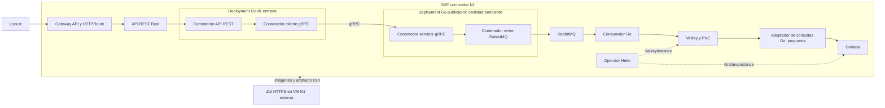

# Paso 1 — Arquitectura y decisiones

## Alcance y límites de esta entrega

Plan elaborado el 29 de septiembre de 2026 a partir del enunciado proporcionado.
Solo se crean documentos dentro de `proyecto3/`. Los cambios existentes del Proyecto 2
permanecen fuera del alcance. Se podrán aprovechar conocimientos previos de Go,
Valkey y Grafana, pero cualquier código reutilizado deberá validar los contratos nuevos.

**Obligatorio:** GKE, máquinas N1, Locust, Gateway API, Rust, Go REST/gRPC,
RabbitMQ, consumidor Go, Operator SDK basado en Helm, CR independientes para
Valkey y Grafana, persistencia, Zot HTTPS en VM externa, artefacto OCI, HPA,
comparativas de réplicas y documentación Markdown.

**Opcional y posterior al cierre obligatorio:** Dapr y Falco. Falco no sustituye
las comprobaciones de corrección funcional del gancho de calidad.

## Arquitectura propuesta

La flecha Valkey → adaptador → Grafana representa el flujo de datos hacia los
paneles; las consultas las inicia Grafana. El adaptador es una decisión de diseño,
no un servicio exigido por el enunciado. Su finalidad es entregar estadísticas
comprobables sin depender de que un plugin pueda calcular moda o rankings.
En el paso 4 se validará una datasource compatible con su JSON; si la consulta
directa a Valkey cubre todos los paneles, se revisará esta decisión antes de construirlo.

| Componente | Responsabilidad y despliegue propuesto |
|---|---|
| Locust | Generar los cinco países y rangos acordados; conservar resultados y configuración de cada corrida. Para la evaluación final, ejecutar en GCP; elegir entre GKE o una VM N1 y documentar su aislamiento respecto del sistema medido. |
| Gateway | GatewayClass soportada por GKE, Gateway y HTTPRoute hacia Rust; ruta pública `/grpc-202100054`. No usar un recurso Ingress como sustituto. |
| Rust | Validar entrada, asignar o propagar identidad y enviar al servicio Go; conservar errores y plazos. Deployment y Service; HPA 1–3, CPU objetivo 30%. |
| Go entrada | Dos contenedores: API REST en puerto propuesto 8081 y puente cliente gRPC interno en 8082. Comunicación interna HTTP por `127.0.0.1`. |
| Go publicador | Dos contenedores: servidor gRPC en 50051 y writer HTTP interno en 8083. El servidor espera confirmación del writer. Escalado por pod completo. |
| RabbitMQ | Exchange y cola durables, mensajes persistentes, confirmación del publicador, ACK manual del consumidor, cola de fallos y almacenamiento persistente. |
| Consumidor Go | Validar mensaje, deduplicar, guardar reporte y actualizar estadísticas de forma atómica antes del ACK. Concurrencia acotada. |
| Operator | Un proceso Helm Operator con dos CRD/kinds y charts independientes: `ValkeyInstance` y `GrafanaInstance`. Imagen propia en Zot. |
| Valkey | StatefulSet, Service de escritura y PVC generados por el Operator. Persistencia habilitada; sin eviction silenciosa de datos estadísticos. |
| Grafana | Deployment, Service, datasource y dashboards aprovisionados mediante su CR. Acceso inicial de administración por port-forward. |
| Adaptador | API interna Go de consultas de solo lectura sobre Valkey, si la prueba de datasource confirma esta solución. |
| Zot | Registro fuera del clúster, HTTPS con confianza verificable desde GKE, autenticación y almacenamiento persistente. |

Los puertos y nombres de recursos son propuestas internas, no requisitos académicos.
Los contenedores compañeros comparten red de pod; sus interfaces internas no necesitan
exposición pública. Cada salto debe transmitir identidad, plazo y resultado.

## Infraestructura y operación

- Propuesta: GKE Standard para controlar la selección de nodos N1; confirmar región,
  cuotas, disponibilidad, tamaño y presupuesto antes del aprovisionamiento.
- Namespaces propuestos: `mumn-app` y `mumn-system`. RBAC del Operator limitado a
  los recursos y namespaces que administrará.
- Configuración no sensible en ConfigMaps; credenciales en Secrets. No almacenar
  credenciales reales en Git. Registrar versiones e imágenes por digest.
- Todas las imágenes de los componentes del proyecto deberán servirse desde Zot,
  incluidas las de terceros, Operator e init containers. Inventariar aparte los
  componentes administrados por GKE; aclarar con la cátedra el alcance de “todas”.
- Archivo OCI propuesto: `load-profile.json`, con países, rangos y semilla para Locust.
  Se publicará como artefacto, se descargará por digest y Locust consumirá esa copia;
  documentar identidad, comando de descarga y uso efectivo. No es suficiente subirlo.
- RabbitMQ y Valkey tendrán volúmenes persistentes. El diseño base de una instancia
  no promete alta disponibilidad ante pérdida de nodo o disco.
- Cada servicio tendrá probes adecuadas, requests/limits y logs con `event_id`.
  La salud del proceso y la disponibilidad para tráfico se comprobarán por separado.
- Antes de cada carga: inventario de recursos y datos de ensayo aislados. Al terminar,
  conservar resultados y definir limpieza de recursos facturables sin borrar evidencias.
- DNS/certificado de Zot, acceso de nodos al registro, almacenamiento y salud del
  backend Gateway son dependencias que deben resolverse antes de la prueba pública.

El controlador Gateway de GKE requiere configuración y condiciones específicas de
red y backend; se verificará con la [guía oficial de despliegue de Gateways](https://docs.cloud.google.com/kubernetes-engine/docs/how-to/deploying-gateways).
El HPA calcula utilización de CPU respecto de los requests y depende de métricas
disponibles; 30% es el objetivo del controlador, no garantía de escalado instantáneo
al cruzar un valor. Véase [Horizontal Pod Autoscaling](https://kubernetes.io/docs/concepts/workloads/autoscaling/horizontal-pod-autoscale/).

## Ciclo de vida del Operator

Usar el plugin Helm de Operator SDK, conforme a su
[quickstart oficial](https://sdk.operatorframework.io/docs/building-operators/helm/quickstart/).
Propuesta: despliegue directo del Operator; OLM no es un requisito identificado.

Cada kind tendrá su chart y configuración declarativa. Campos propuestos:

- `ValkeyInstance`: imagen, recursos, almacenamiento, configuración de persistencia
  y topología soportada. La topología de réplica queda pendiente de aclaración.
- `GrafanaInstance`: imagen, recursos, referencia a Secret de administración,
  datasource, dashboards y persistencia de configuración si resulta necesaria.

Validar creación, actualización, recuperación de recursos gestionados y eliminación
de cada CR con datos desechables. La política propuesta retiene los PVC al eliminar
un CR y elimina los recursos no persistentes; debe probarse y documentarse explícitamente.
No asumir que cualquier cambio Helm provoca reconciliación continua inmediata: comprobar
watches y reconciliación periódica en la versión elegida.

## Registro de decisiones

| ID | Estado | Decisión o asunto | Condición para cerrarlo |
|---|---|---|---|
| D01 | Propuesta | Gateway API prevalece sobre la mención antigua de Ingress. | Aprobar interpretación y registrarla en manual. |
| D02 | Consulta a cátedra | El alcance dice “Deployments 2 y 3”, pero la metodología solo describe el 2. | Confirmar si son dos deployments publicadores distintos o un deployment con 1/2 réplicas; conservar dos contenedores por pod requerido. |
| D03 | Consulta a cátedra | La rúbrica incluye comparación de Valkey con 1 y 2 réplicas. | Confirmar si significa 1/2 instancias totales o 1/2 réplicas adicionales. Propuesta de ensayo: primario solo frente a primario más réplica de lectura. |
| D04 | Propuesta | Valkey/Grafana dentro de GKE, pese al encabezado antiguo “persistencia en VM”. | Aprobar interpretación conforme al alcance. |
| D05 | Propuesta | Estadísticas por corrida; rankings según último estado conocido por país. | Aprobar semántica del contrato o ajustar tras aclaración de cátedra. |
| D06 | Propuesta | Entrada limita aviones a 0–50 y barcos a 0–30. | Aprobar usar los rangos sugeridos también como validación. |
| D07 | Propuesta | Identidad en cabeceras/metadatos; JSON académico sin campos nuevos. | Aprobar contrato e idempotencia por corrida. |
| D08 | Pendiente técnico | Adaptador Go y datasource Grafana frente a conexión directa. | Prueba mínima de consulta con resultados exactos antes de construir paneles completos. |
| D09 | Información pendiente | Proyecto GCP, región, cuotas N1, presupuesto, DNS/certificado Zot. | Datos del usuario y verificación del entorno antes del paso 5. |
| D10 | Propuesta | Las imágenes del proyecto y sus auxiliares se consumen desde Zot. | Inventario completo y aclaración del alcance sobre componentes administrados. |
| D11 | Fuera del alcance base | Dapr y Falco opcionales. | Decidir después de cerrar lo obligatorio y revisar tiempo disponible. |

Para D03, dos servidores independientes detrás del mismo Service no representan un
almacén consistente. Una réplica Valkey recibe datos del primario; la replicación es
asíncrona y no implica por sí sola failover automático. Se medirán lecturas y escritura
por separado, sin prometer duplicación de rendimiento. Fuente: [replicación de Valkey](https://valkey.io/topics/replication/).

## Fases y aprobación

| Paso | Horas orientativas | Entregable | Dependencias |
|---|---:|---|---|
| 1 | 5 | Estos documentos revisados, contratos y matriz aprobados. | Enunciado y repositorio. |
| 2 | 4 | Esqueleto, configuración de desarrollo y validación reproducible. | Aprobar contratos; resolver D02 antes de fijar estructura Go definitiva. |
| 3 | 12 | Flujo completo de servicios y broker con pruebas funcionales. | Paso 2; entorno de prueba para Valkey. |
| 4 | 14 | Operator, persistencia y todos los paneles. | Modelo de datos; prueba de datasource temprana. |
| 5 | 10 | GKE, Zot HTTPS, artefacto OCI y Gateway operativos. | D09 resuelta; imágenes y manifiestos revisados. |
| 6 | 8 | Carga, HPA, comparativas de réplicas y recuperación. | Flujo público estable; D03 resuelta. |
| 7 | 7 | Manual, evidencias, revisión de acceso y entrega. | Matriz obligatoria completa. |

Total orientativo: 60 horas, no registro de horas realizadas. Los pasos 3 y 4 pueden
intercalar la prueba de almacenamiento/datasource para detectar temprano la incompatibilidad.
Desarrollar el manual durante todas las fases y reservar el cierre antes del 22/10/2026.
El calendario exacto depende de disponibilidad del estudiante y acceso a GCP.

En cada paso se presentan cambios, pruebas realizadas, fallos y asuntos pendientes.
El usuario acepta el resultado y autoriza avanzar. Este paso no instala un hook,
no ejecuta cargas, no crea infraestructura ni agrega colaboradores.
